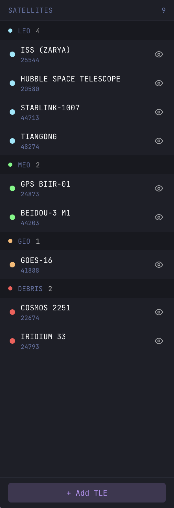
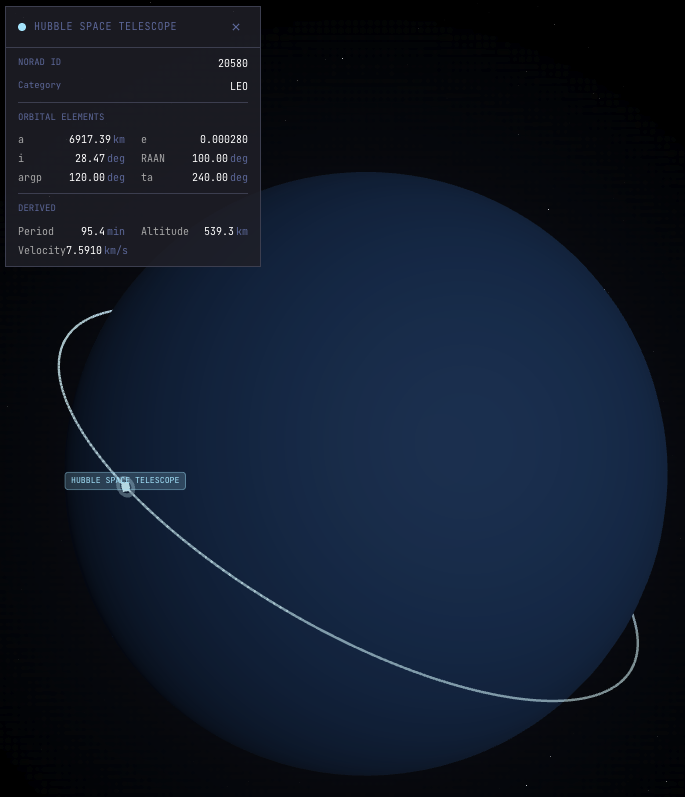
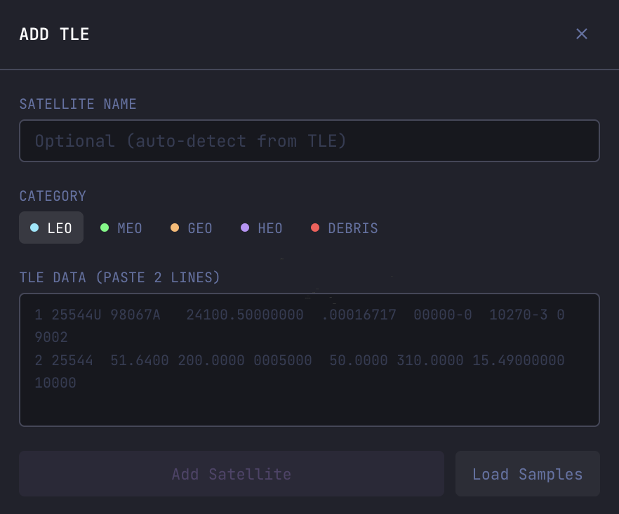
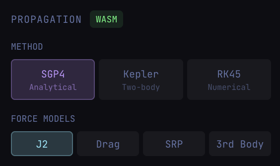
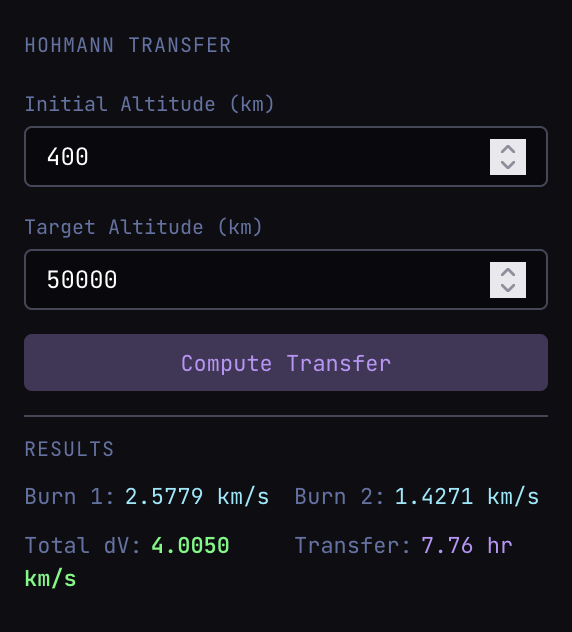
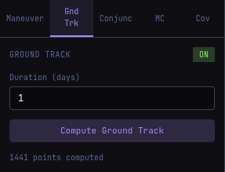
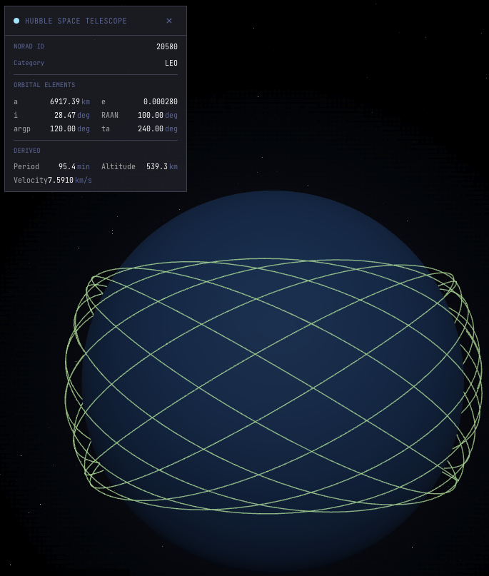
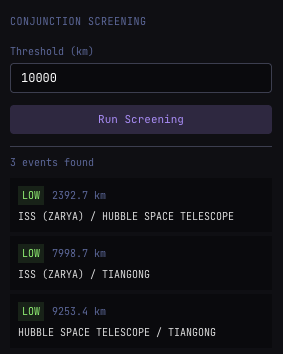
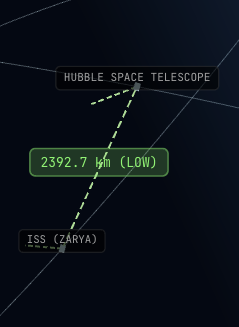

# Zenith: Browser-based satellite mission planner with real-time 3D visualization

[](https://react.dev/)
[](https://www.typescriptlang.org/)
[](https://emscripten.org/)

Zenith is an interactive satellite mission planner and orbital mechanics educational tool. Propagate orbits with SGP4, plan Hohmann transfers, screen conjunctions, run Monte Carlo analysis, and design Walker constellations, all in the browser.

1. **Parse** real TLE data with NORAD checksum validation
2. **Propagate** orbits using SGP4/SDP4 via a C++ WASM engine
3. **Analyze** conjunctions, maneuver options, ground tracks, and constellation coverage
4. **Visualize** everything in real-time 3D

---

## Demo

<!-- TODO: Add demo video/GIF here -->

*Interactive 3D Earth with real-time satellite propagation. Load TLE data, track multiple satellites, and analyze orbital mechanics with mission planning tools.*

---

## Why Zenith Web

Most orbital mechanics web demos stop at a static 3D globe with pre-computed orbits. Zenith Web runs the **full flight dynamics pipeline** in the browser:

---

## Application Walkthrough

### 3D Earth and Orbit Visualization

The main viewport renders a textured 3D Earth with orbit paths, satellite markers, and a starfield background. Satellites are rendered as cubesats with category-coded colors (LEO=cyan, MEO=green, GEO=orange, debris=red). Click any satellite to select it and view its orbital elements.

<!-- TODO: Add 3D Earth view screenshot here -->

*3D Earth with orbit paths and satellite markers. The left sidebar shows the satellite list with category grouping and visibility toggles.*

### Satellite List and TLE Input

The left sidebar displays all loaded satellites grouped by orbit category. Add satellites via the TLE input modal, which validates NORAD checksums and extracts orbital elements. Pre-loaded sample satellites include ISS, Hubble, Starlink, GPS, GOES, and debris objects.



*Satellite list with category headers, visibility toggles, and the "+ Add TLE" button. Click a satellite to view its details and orbital elements.*



*Satellite list alongside the 3D orbit visualization.*



*TLE input modal with NORAD checksum validation. Paste any Two-Line Element set to add a satellite.*

### Propagation Controls

Configure the propagation method and force models from the top control bar. The WASM engine supports full SGP4/SDP4 with J2 oblateness, atmospheric drag, solar radiation pressure, and third-body perturbations. A TypeScript Keplerian fallback is available when WASM is unavailable.



*Propagation configuration: method selector (SGP4, Kepler, RK45), force model toggles (J2, Drag, SRP, 3rd Body), and current epoch display. WASM/TS status indicator shows which engine is active.*

### Time Controls

Control the simulation time with play/pause, speed adjustment (0.1x to 10x), and step forward/backward by one orbital period. The current epoch is displayed as UTC. Use keyboard shortcuts for quick control: Space (play/pause), R (reset), +/- (speed).

<!-- TODO: Add time controls screenshot here -->

*Time control bar: play/pause, step backward/forward, reset, and speed selector. Pinned to the top of the 3D viewport.*

### Hohmann Transfer Planning

Plan orbital transfers by specifying initial and target altitudes. The maneuver panel computes the complete delta-V budget (departure burn, arrival burn, total) and transfer time. The transfer orbit renders as a dashed overlay in the 3D scene.



*Hohmann transfer configuration: initial altitude (400 km LEO), target altitude (35,786 km GEO). Results show Burn 1, Burn 2, total delta-V, and transfer time.*

<!-- TODO: Add transfer orbit 3D visualization screenshot here -->

*3D view showing the original orbit (cyan) with the dashed Hohmann transfer orbit (orange) connecting departure and arrival points.*

### Ground Track Rendering

Compute and visualize sub-satellite ground tracks on the 3D Earth. The ground track shows the satellite's footprint over time with anti-meridian handling (no visual artifacts at the date line). Configure propagation duration from 0.1 to 30 days.



*Ground track configuration: duration input, ON/OFF toggle, and compute button. Requires a satellite to be selected.*



*Ground track rendered on the Earth surface showing the satellite's sub-satellite point over multiple orbits. Green polyline follows the orbital path.*

### Conjunction Assessment

Screen all loaded satellite pairs for close approaches at the current epoch. The conjunction panel computes miss distances and classifies risk levels (CRITICAL < 1 km, HIGH < 5 km, MODERATE < 25 km, LOW > 25 km). Events are sorted by proximity.



*Conjunction screening results: risk level badges (CRITICAL/HIGH/MODERATE/LOW), miss distance in km, and satellite pair names. Configurable screening threshold.*



*3D view showing conjunction markers between satellite pairs at close approach points.*

### Monte Carlo Uncertainty Propagation

Propagate Gaussian initial condition uncertainty through orbital dynamics. Configure position/velocity standard deviations, sample count (100-5000), propagation duration, and random seed. Results show mean state, per-axis standard deviations, and 3-sigma bounds.

<!-- TODO: Add Monte Carlo panel screenshot here -->

*Monte Carlo configuration: number of samples, position sigma (km), velocity sigma (km/s), duration (days), and random seed. Toggle scatter cloud and uncertainty ellipsoid visualization.*

### Walker Delta Constellation Designer

Design satellite constellations using the Walker Delta pattern (i:T/P/F). Configure total satellites, number of orbital planes, phasing factor, inclination, and altitude. Generate constellation states for coverage analysis.

<!-- TODO: Add Walker Delta coverage panel screenshot here -->

*Walker Delta constellation designer: total satellites (24), planes (6), inclination (55 deg), altitude (20,200 km GPS), and phasing factor. One-click constellation generation.*

### Keyboard Shortcuts

| Key | Action |
|-----|--------|
| `Space` | Play / Pause simulation |
| `R` | Reset time to current epoch |
| `+` / `=` | Increase time speed (2x) |
| `-` | Decrease time speed (0.5x) |
| `Delete` | Remove selected satellite |

### Mission Export / Import

Save your mission configuration (satellites, TLEs, time settings) as a JSON file. Import previously saved missions to restore the exact state. Useful for sharing configurations and creating reusable mission templates.

---

## Key Capabilities

- **SGP4/SDP4 propagation**: Vallado reference implementation via C++ WASM, TEME output
- **TypeScript fallback**: Keplerian propagation when WASM is unavailable
- **14 C++ analysis headers**: SGP4, Kepler, force models, integrators, conjunction, maneuver, ground track, Monte Carlo, coverage, pass predictor
- **Hohmann transfer planning**: Delta-V budget with 3D transfer orbit visualization
- **Conjunction assessment**: Pairwise close-approach screening with risk classification
- **Monte Carlo analysis**: Gaussian sampling with scatter cloud and uncertainty ellipsoid
- **Walker Delta constellations**: Generate and visualize multi-plane constellations
- **Ground track rendering**: Sub-satellite points on 3D Earth with anti-meridian handling
- **Real-time 3D visualization**: React Three Fiber, orbit camera, starfield, category-coded satellites
- **Mission persistence**: JSON export/import of full mission state

---

## Quick Start

### Prerequisites

- Node.js 18+
- npm 9+
- Emscripten (optional, for WASM build)

### Install and Run

```bash
npm install
npm run dev
```

Open `http://localhost:5173` in your browser.

### Build for Production

```bash
npm run build          # TypeScript check + Vite production build
npm run preview        # Preview the production build locally
```

### Run Tests

```bash
npm run test           # Run all tests
npm run test:watch     # Watch mode
```

### Build WASM Module (Optional)

Requires Emscripten installed via Homebrew:

```bash
brew install emscripten
cd wasm && bash build.sh
```

This compiles the C++ analysis engine to WebAssembly and copies the output to `public/wasm/`.

---

## Architecture

```
zenith-web/
  src/
    orbit/              # Orbital mechanics engine
      wasmLoader.ts     # WASM init + TS fallback propagator
      analysisLoader.ts # WASM/TS analysis wrappers
      types.ts          # TypeScript type definitions
      constants.ts      # Physics constants (MU_EARTH, R_EARTH, J2)
      sampleTles.ts     # Sample TLE data for demo
    processing/
      tle_parser.ts     # NORAD TLE parser with checksum validation
    store/
      useMissionStore.ts    # Zustand store: satellites, time, propagation
      useAnalysisStore.ts   # Zustand store: analysis results, tool state
    components/
      scene/            # React Three Fiber 3D components
        OrbitScene.tsx      # Main 3D canvas
        Earth.tsx           # Textured Earth sphere
        OrbitPath.tsx       # Orbit trail visualization
        SatelliteMarker.tsx # Cubesat markers with labels
        CameraController.tsx # Orbit camera with fly-to animation
        GroundTrackLine.tsx # Ground track on Earth surface
        TransferOrbitPath.tsx # Dashed Hohmann transfer orbit
      ui/               # 2D UI panels
        SatelliteList.tsx   # Satellite list sidebar
        TLEInput.tsx        # TLE input modal
        TimeControls.tsx    # Play/pause/speed controls
        PropagationPanel.tsx # Method and force model config
        SatelliteInfo.tsx   # Selected satellite details
        ResizeHandle.tsx    # Draggable panel divider
      analysis/         # Analysis tool panels
        AnalysisPanel.tsx   # Tabbed analysis container
        ManeuverPanel.tsx   # Hohmann transfer planner
        GroundTrackPanel.tsx # Ground track controls
        ConjunctionPanel.tsx # Conjunction screening
        MonteCarloPanel.tsx  # Monte Carlo configuration
        CoveragePanel.tsx    # Walker constellation designer
    hooks/
      useKeyboardShortcuts.ts # Global keyboard handler
    utils/
      orbitTrail.ts     # Orbit trail computation
      missionExport.ts  # JSON export/import
    styles/
      globals.css       # Tailwind + Dracula dark theme
  wasm/                 # C++ to WASM build
    CMakeLists.txt      # Emscripten CMake config
    build.sh            # Build script
    src/
      exports.cpp       # Emscripten embind bindings (10 functions)
      zenith/           # 14 C++ headers (header-only)
  public/
    wasm/               # Compiled WASM output
      zenith.js         # JS glue code
      zenith.wasm.wasm  # WASM binary
```

---

## Data Flow

```
TLE Text
  |
  v
TLE Parser (tle_parser.ts) -- checksum validation, field extraction
  |
  v
WASM Init (wasmLoader.ts) -- sgp4_init() returns propagator handle
  |
  v
Propagation Loop
  |-- WASM path: sgp4_propagate(handle, jd) -> {x,y,z,vx,vy,vz}
  |-- TS path: Keplerian fallback -> simplified state
  |
  v
State Vectors (TEME frame, km/km/s)
  |
  +---> Orbit Trail (orbitTrail.ts) -> Three.js Vector3[] -> OrbitPath
  +---> Ground Track (analysisLoader.ts) -> lat/lon -> GroundTrackLine
  +---> Satellite Position -> SatelliteMarker (cubesat)
  +---> Analysis Modules
        |-- Hohmann Transfer -> delta-V budget + TransferOrbitPath
        |-- Conjunction Screening -> miss distance + risk level
        |-- Monte Carlo -> scatter cloud + uncertainty ellipsoid
        |-- Walker Constellation -> coverage analysis
```

---

## Validation

All implementations are validated against published reference data.

- **SGP4 LEO (ISS)**: < 1 km over 7 days against Vallado Spacetrack Report #3
- **Hohmann delta-V**: < 0.001 km/s against closed-form solution
- **Lambert solver**: Converges in < 20 iterations (universal variable)
- **Kepler propagation**: < 0.001% energy conservation over one orbit
- **TLE parser**: Checksum validation against NORAD reference format
- **Coordinate transforms**: TEME to geodetic lat/lon for ground tracks

---

## Tech Stack

| Layer | Technology |
|-------|-----------|
| **Frontend** | React 19, TypeScript 5.7, Three.js 0.170 |
| **3D Rendering** | @react-three/fiber, @react-three/drei |
| **State** | Zustand 5 |
| **Routing** | React Router 7 |
| **Math** | KaTeX (LaTeX rendering) |
| **Styling** | Tailwind CSS 3 (Dracula dark theme) |
| **Build** | Vite 6 |
| **WASM** | Emscripten 6.0 (C++ to WebAssembly) |
| **Physics** | Zenith C++ core (14 header-only modules) |
| **Testing** | Vitest 5, @testing-library/react |
| **Language** | TypeScript (frontend), C++20 (WASM backend) |

---

## Testing

229 tests across 14 test files covering:

| Module | Tests | Coverage |
|--------|-------|----------|
| TLE Parser | 39 | Checksum, field extraction, epoch conversion, batch parsing |
| WASM Loader | 23 | Init, propagation, elements, fallback behavior |
| Constants | 16 | All 15 physics constants + conversion identities |
| Sample TLEs | 18 | Data integrity, lookups, category filtering |
| Zustand Store | 39 | All store actions, state transitions, color mapping |
| Orbit Trail | 12 | Trail computation, axis mapping, scale factors |
| UI Components | 58 | SatelliteList, TimeControls, PropagationPanel, SatelliteInfo, TLEInput |
| Analysis Loader | 5 | Hohmann TS fallback, WASM delegation |

```bash
npm run test           # Run all tests
npm run test:watch     # Watch mode
```

---

## What This Demonstrates

For Flight Dynamics Analyst and GNC Engineer roles:

- **Orbit propagation competency**: SGP4/SDP4 with WASM acceleration, Keplerian fallback
- **WebAssembly integration**: C++ to WASM via Emscripten embind, JS/TS interop
- **Full-stack development**: React 19, Three.js, Zustand, Vite, TypeScript
- **Analysis skills**: Conjunction assessment, maneuver planning, Monte Carlo, constellation design
- **Software engineering**: 229 tests, typed interfaces, component architecture
- **Visualization**: Real-time 3D rendering, ground tracks, transfer orbits, uncertainty clouds

---

## References

1. Vallado, D.A., "Fundamentals of Astrodynamics and Applications", 4th ed., Microcosm Press, 2013.
2. Vallado, D.A., Crawford, P., Hujsak, R., and Kelso, T.S., "Revisiting Spacetrack Report #3", AIAA 2006-6753, 2006.
3. Curtis, H.D., "Orbital Mechanics for Engineering Students", 3rd ed., Butterworth-Heinemann, 2013.
4. Battin, R.H., "Introduction to the Mathematics and Methods of Astrodynamics", AIAA Education Series, 1999.
5. Foster, J., "The 2D Probability of Collision Formula", Proceedings of the AMOS, 1992.

---

## License

This project is licensed under the MIT License.

---

<p align="center">
  <i>Built for Flight Dynamics Analyst and GNC Engineer roles at MDA, SpaceX, ULA, and similar.</i>
</p>
