# Zenith: Browser-based satellite mission planner with real-time 3D visualization

[](https://react.dev/)
[](https://isocpp.org/)

Zenith is an interactive satellite mission planner and orbital mechanics educational tool. Propagate orbits with SGP4, plan Hohmann transfers, screen conjunctions, run Monte Carlo analysis, and design Walker constellations, all in the browser.

#### Features
- **SGP4/SDP4 Propagation** via a C++ WASM engine
- **Real TLE parsing** with NORAD checksum validation and satellite catalog
- **Hohmann Transfer Planning** with delta-V budget and 3D transfer orbit visualization
- **Plane Change & Phasing Maneuvers** with combined delta-V computation
- **Hohmann vs Bi-Elliptic Comparison** for transfer efficiency analysis
- **Lambert Solver** for trajectory design and rendezvous planning
- **Ground Track Rendering** with anti-meridian handling on the 3D Earth
- **Eclipse/Shadow Analysis** for solar illumination and power system planning
- **Conjunction Screening** with single-epoch, time-window modes, and risk classification
- **Pass Predictor** for ground station visibility windows with AOS/LOS times
- **Monte Carlo Uncertainty Propagation** with scatter cloud and 3D uncertainty ellipsoid
- **Walker Delta Constellation Designer** for multi-plane constellation generation
- **Real-time 3D Visualization** with React Three Fiber, orbit camera, and category-coded satellites
- **Mission Export/Import** for saving and sharing configurations as JSON


---

## Demo

<!-- TODO: Add demo video/GIF here -->

*Interactive 3D Earth with real-time satellite propagation. Load TLE data, track multiple satellites, and analyze orbital mechanics with mission planning tools.*

---

## Application Walkthrough

### Full UI Overview

The application is organized into three panels: a left sidebar for satellite management, a center 3D scene for orbit visualization, and a right sidebar containing collapsible analysis tool sections. Multiple analysis sections can be open simultaneously.

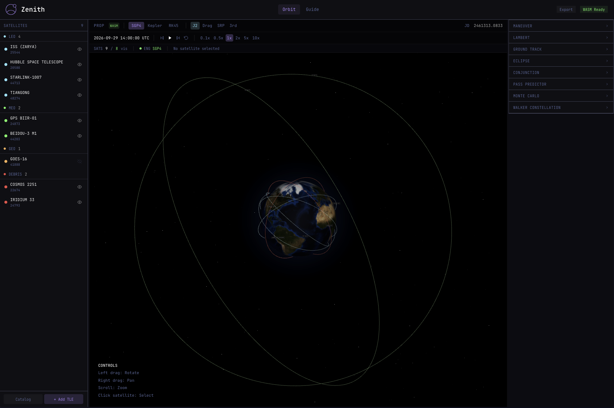

*Full application layout: left sidebar with satellite list, center 3D scene with orbit paths and Earth, and right sidebar with stacked analysis tool panels.*

### Satellite List and TLE Input

The left sidebar displays all loaded satellites grouped by orbit category (LEO, MEO, GEO, HEO, debris). Click a satellite to select it and view its orbital elements. The visibility toggle (eye icon) controls whether the satellite and its orbit path appear in the 3D scene.

| | | |
|---|---|---|
| 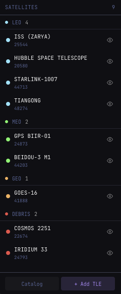 | 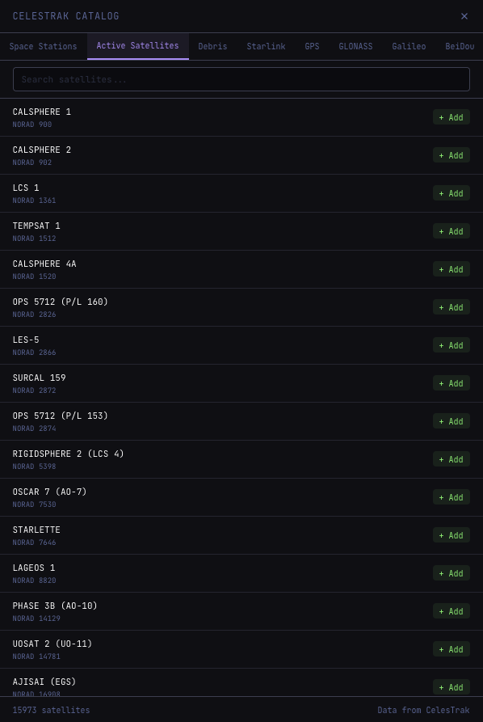 | 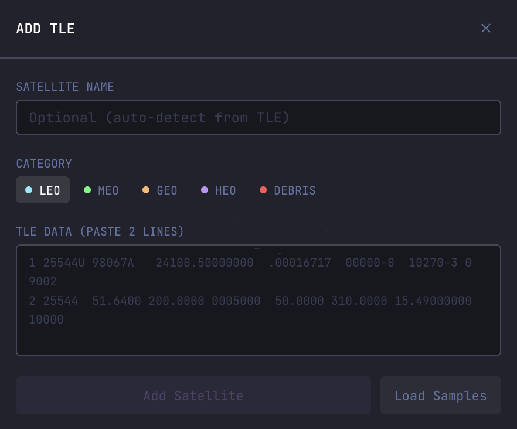 |
| *Satellite list with category grouping, visibility toggles, and the "+ Add TLE" button.* | *Catalog browser for searching and adding satellites from the full NORAD catalog.* | *TLE input modal with NORAD checksum validation. Paste any TLE to add a satellite.* |

### Propagation Controls

Configure the propagation method and force models from the propagation panel. The WASM engine supports full SGP4/SDP4 with J2 oblateness, atmospheric drag, solar radiation pressure, and third-body perturbations. A TypeScript Keplerian fallback is available when WASM is unavailable.

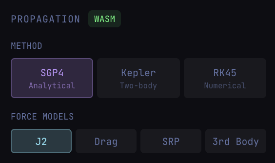

*Propagation configuration: method selector (SGP4, Kepler, RK45), force model toggles (J2, Drag, SRP, 3rd Body), and current epoch display. WASM/TS status indicator shows which engine is active.*

### Time Controls

Control the simulation time with play/pause, speed adjustment (0.1x to 10x), and step forward/backward by one orbital period. The current epoch is displayed as UTC. Use keyboard shortcuts for quick control: Space (play/pause), R (reset), +/- (speed).

<!-- TODO: Add time controls screenshot here -->

*Time control bar: play/pause, step backward/forward, reset, and speed selector. Pinned to the top of the 3D viewport.*

### Hohmann Transfer Planning

The Maneuver panel provides four sub-tabs for orbital maneuver analysis:

- **Hohmann**: Compute the fuel-optimal two-impulse transfer between circular orbits. Enter initial and target altitudes to get Burn 1, Burn 2, total delta-V, and transfer time.
- **Plane Change**: Combine a Hohmann transfer with an inclination change. Specify initial/target altitude and inclination change to get the combined delta-V budget.
- **Phasing**: Compute phasing orbit parameters for a satellite to close a phase angle gap. Specify orbit altitude, phase angle, and number of periods.
- **Comparison**: Compare Hohmann vs Bi-Elliptic transfer efficiency for a given initial/target orbit.

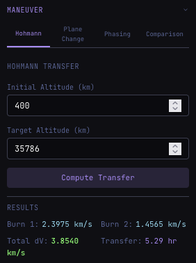

*Maneuver panel with Hohmann sub-tab selected. Enter initial and target altitudes to compute the complete delta-V budget.*

The transfer orbit renders as a dashed path in the 3D scene, connecting departure and arrival points.

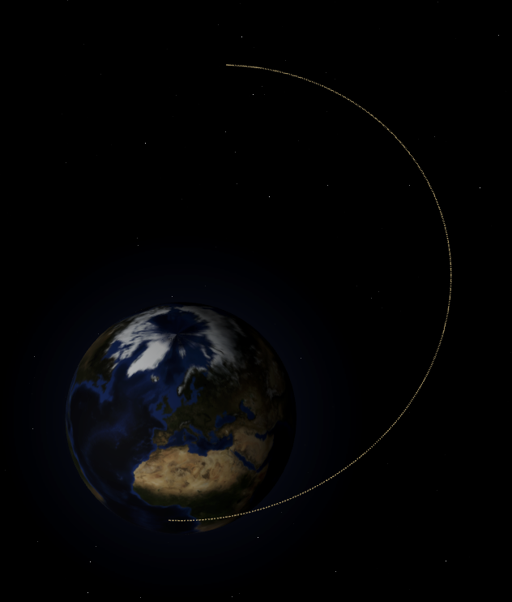

*3D view showing the original orbit (cyan) with the dashed Hohmann transfer orbit (orange) connecting departure and arrival points.*

### Lambert Solver

Solve Lambert's problem for trajectory design: given departure and arrival positions (in TEME km) and a time of flight (in seconds), find the velocity vectors at both endpoints. This is essential for interplanetary transfer design, rendezvous planning, and orbit determination from angles-only observations. The solver uses the WASM universal variable method with Stumpff function iteration.

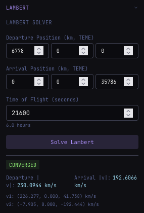

*Lambert solver panel: enter departure/arrival position vectors (x, y, z in TEME km) and time of flight. Returns velocity vectors at both endpoints and convergence status.*

### Ground Track Rendering

Compute and visualize sub-satellite ground tracks on the 3D Earth. The ground track shows the satellite's footprint over time with anti-meridian handling (no visual artifacts at the date line). Configure propagation duration from 0.1 to 30 days.

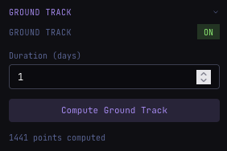

*Ground track configuration: duration input, ON/OFF toggle, and compute button. Requires a satellite to be selected.*

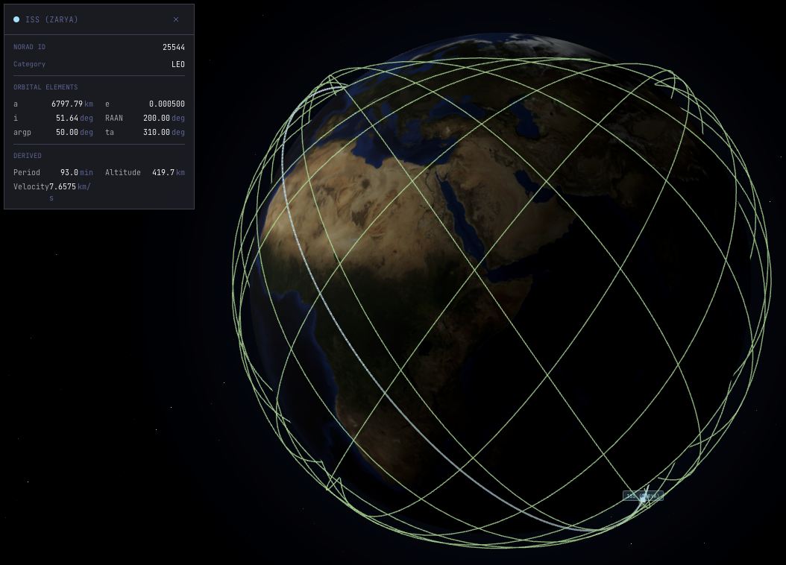

*Ground track rendered on the Earth surface showing the satellite's sub-satellite point over multiple orbits. Green polyline follows the orbital path.*

### Eclipse/Shadow Analysis

Compute solar eclipse and shadow events for a satellite over a configurable duration. The tool reports eclipse fraction (percentage of time in shadow), total event count, and individual event entry/exit UTC times with duration statistics (average, maximum, minimum). Useful for power system design and thermal analysis.

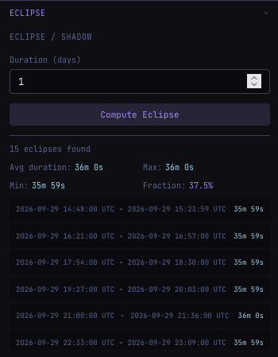

*Eclipse analysis panel: enter duration in days to compute shadow events. Results include eclipse fraction, event count, and entry/exit UTC times.*

### Conjunction Assessment

Screen all loaded satellite pairs for close approaches. Zenith supports two screening modes:

- **Single Epoch**: Checks positions at the current simulation time and computes miss distances for all pairs.
- **Time Window**: Propagates all satellites over a configurable duration and time step to find the closest approach for each pair. Uses WASM-accelerated batch screening and reports the Time of Closest Approach (TCA).

Events are classified by risk level: CRITICAL (< 1 km), HIGH (1-5 km), MODERATE (5-25 km), LOW (> 25 km).

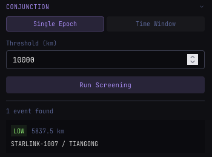

*Conjunction screening panel with Single Epoch and Time Window modes. Set the screening threshold and toggle 3D markers to visualize close approaches.*

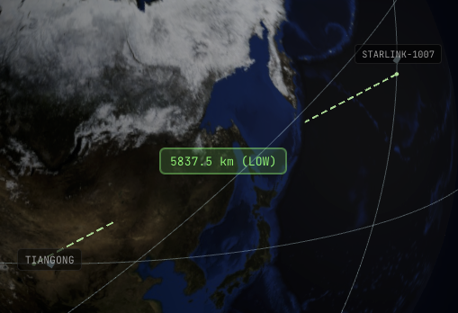

*3D view showing conjunction markers between satellite pairs at close approach points.*

### Pass Predictor

Predict ground station passes for a satellite. The tool propagates the orbit over a configurable time window and computes visibility from the ground station location, accounting for the elevation mask angle. For each pass, it reports AOS/LOS times, maximum elevation angle, pass duration, and minimum slant range.

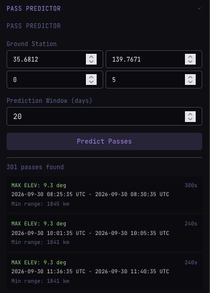

*Pass predictor panel: configure ground station latitude, longitude, altitude, and elevation mask. Set prediction window duration and click Predict Passes.*

### Monte Carlo Uncertainty Propagation

Propagate Gaussian initial condition uncertainty through orbital dynamics. The tool adds Gaussian noise to the satellite's initial state, propagates each sample, and computes statistics (mean state, per-axis standard deviations, 3-sigma bounds). Results include a point cloud of all samples and a 3D uncertainty ellipsoid.

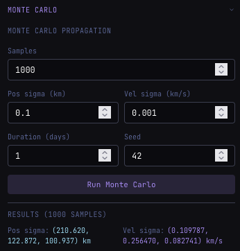

*Monte Carlo configuration: number of samples (100-5000), position sigma (km), velocity sigma (km/s), duration (days), and random seed. Toggle Cloud and Ellipsoid visualization.*

### Walker Delta Constellation Designer

Design satellite constellations using the Walker Delta pattern (i:T/P/F). Configure total satellites, number of orbital planes, inclination (degrees), altitude (km), and phasing factor. The RAAN spacing is uniform across planes, and mean anomaly offsets ensure even coverage. One click generates the full constellation and adds all satellites to the 3D scene.

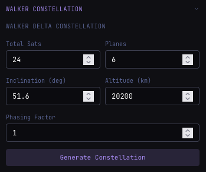

*Walker Delta constellation designer: total satellites, planes, inclination, altitude, and phasing factor. One-click constellation generation.*

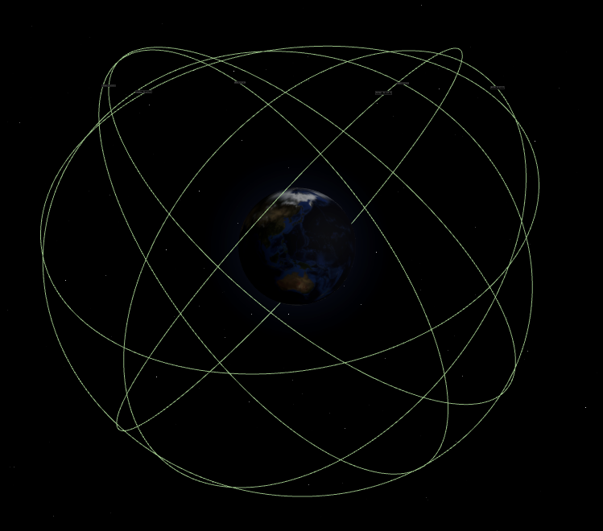

*Walker Delta constellation rendered in 3D with multiple orbital planes and satellite markers.*

### Keyboard Shortcuts

| Key | Action |
|-----|--------|
| `Space` | Play / Pause simulation |
| `R` | Reset time to current epoch |
| `+` / `=` | Increase time speed (2x) |
| `-` | Decrease time speed (0.5x) |
| `Delete` | Remove selected satellite |

### Mission Export / Import

Save your mission configuration (satellites, TLEs, time settings) as a JSON file. Import previously saved missions to restore the exact state. Useful for sharing configurations and creating reusable mission templates.

---

## Quick Start

### Prerequisites

- Node.js 18+
- npm 9+
- Emscripten (optional, for WASM build)

### Install and Run

```bash
npm install
npm run dev
```

Open `http://localhost:5173` in your browser.

### Build for Production

```bash
npm run build          # TypeScript check + Vite production build
npm run preview        # Preview the production build locally
```

### Run Tests

```bash
npm run test           # Run all tests
npm run test:watch     # Watch mode
```

### Build WASM Module (Optional)

Requires Emscripten installed via Homebrew:

```bash
brew install emscripten
cd wasm && bash build.sh
```

This compiles the C++ analysis engine to WebAssembly and copies the output to `public/wasm/`.

---

## Architecture

```
zenith-web/
  src/
    orbit/              # Orbital mechanics engine
      wasmLoader.ts     # WASM init + TS fallback propagator
      analysisLoader.ts # WASM/TS analysis wrappers
      types.ts          # TypeScript type definitions
      constants.ts      # Physics constants (MU_EARTH, R_EARTH, J2)
      sampleTles.ts     # Sample TLE data for demo
    processing/
      tle_parser.ts     # NORAD TLE parser with checksum validation
    store/
      useMissionStore.ts    # Zustand store: satellites, time, propagation
      useAnalysisStore.ts   # Zustand store: analysis results, tool state
    components/
      scene/            # React Three Fiber 3D components
        OrbitScene.tsx      # Main 3D canvas
        Earth.tsx           # Textured Earth sphere
        OrbitPath.tsx       # Orbit trail visualization
        SatelliteMarker.tsx # Cubesat markers with labels
        CameraController.tsx # Orbit camera with fly-to animation
        GroundTrackLine.tsx # Ground track on Earth surface
        TransferOrbitPath.tsx # Dashed Hohmann transfer orbit
      ui/               # 2D UI panels
        SatelliteList.tsx   # Satellite list sidebar
        TLEInput.tsx        # TLE input modal
        TimeControls.tsx    # Play/pause/speed controls
        PropagationPanel.tsx # Method and force model config
        SatelliteInfo.tsx   # Selected satellite details
        ResizeHandle.tsx    # Draggable panel divider
      analysis/         # Analysis tool panels
        AnalysisPanel.tsx   # Tabbed analysis container
        ManeuverPanel.tsx   # Hohmann transfer planner
        GroundTrackPanel.tsx # Ground track controls
        ConjunctionPanel.tsx # Conjunction screening
        MonteCarloPanel.tsx  # Monte Carlo configuration
        CoveragePanel.tsx    # Walker constellation designer
    hooks/
      useKeyboardShortcuts.ts # Global keyboard handler
    utils/
      orbitTrail.ts     # Orbit trail computation
      missionExport.ts  # JSON export/import
    styles/
      globals.css       # Tailwind + Dracula dark theme
  wasm/                 # C++ to WASM build
    CMakeLists.txt      # Emscripten CMake config
    build.sh            # Build script
    src/
      exports.cpp       # Emscripten embind bindings (10 functions)
      zenith/           # 14 C++ headers (header-only)
  public/
    wasm/               # Compiled WASM output
      zenith.js         # JS glue code
      zenith.wasm.wasm  # WASM binary
```

---

## Data Flow

```
TLE Text
  |
  v
TLE Parser (tle_parser.ts) -- checksum validation, field extraction
  |
  v
WASM Init (wasmLoader.ts) -- sgp4_init() returns propagator handle
  |
  v
Propagation Loop
  |-- WASM path: sgp4_propagate(handle, jd) -> {x,y,z,vx,vy,vz}
  |-- TS path: Keplerian fallback -> simplified state
  |
  v
State Vectors (TEME frame, km/km/s)
  |
  +---> Orbit Trail (orbitTrail.ts) -> Three.js Vector3[] -> OrbitPath
  +---> Ground Track (analysisLoader.ts) -> lat/lon -> GroundTrackLine
  +---> Satellite Position -> SatelliteMarker (cubesat)
  +---> Analysis Modules
        |-- Hohmann Transfer -> delta-V budget + TransferOrbitPath
        |-- Conjunction Screening -> miss distance + risk level
        |-- Monte Carlo -> scatter cloud + uncertainty ellipsoid
        |-- Walker Constellation -> coverage analysis
```

---

## Validation

All implementations are validated against published reference data.

- **SGP4 LEO (ISS)**: < 1 km over 7 days against Vallado Spacetrack Report #3
- **Hohmann delta-V**: < 0.001 km/s against closed-form solution
- **Lambert solver**: Converges in < 20 iterations (universal variable)
- **Kepler propagation**: < 0.001% energy conservation over one orbit
- **TLE parser**: Checksum validation against NORAD reference format
- **Coordinate transforms**: TEME to geodetic lat/lon for ground tracks

---

## Tech Stack

| Layer | Technology |
|-------|-----------|
| **Frontend** | React 19, TypeScript 5.7, Three.js 0.170 |
| **3D Rendering** | @react-three/fiber, @react-three/drei |
| **State** | Zustand 5 |
| **Routing** | React Router 7 |
| **Math** | KaTeX (LaTeX rendering) |
| **Styling** | Tailwind CSS 3 (Dracula dark theme) |
| **Build** | Vite 6 |
| **WASM** | Emscripten 6.0 (C++ to WebAssembly) |
| **Physics** | Zenith C++ core (14 header-only modules) |
| **Testing** | Vitest 5, @testing-library/react |
| **Language** | TypeScript (frontend), C++20 (WASM backend) |

---

## Testing

229 tests across 14 test files covering:

| Module | Tests | Coverage |
|--------|-------|----------|
| TLE Parser | 39 | Checksum, field extraction, epoch conversion, batch parsing |
| WASM Loader | 23 | Init, propagation, elements, fallback behavior |
| Constants | 16 | All 15 physics constants + conversion identities |
| Sample TLEs | 18 | Data integrity, lookups, category filtering |
| Zustand Store | 39 | All store actions, state transitions, color mapping |
| Orbit Trail | 12 | Trail computation, axis mapping, scale factors |
| UI Components | 58 | SatelliteList, TimeControls, PropagationPanel, SatelliteInfo, TLEInput |
| Analysis Loader | 5 | Hohmann TS fallback, WASM delegation |

```bash
npm run test           # Run all tests
npm run test:watch     # Watch mode
```

---

## References

1. Vallado, D.A., "Fundamentals of Astrodynamics and Applications", 4th ed., Microcosm Press, 2013.
2. Vallado, D.A., Crawford, P., Hujsak, R., and Kelso, T.S., "Revisiting Spacetrack Report #3", AIAA 2006-6753, 2006.
3. Curtis, H.D., "Orbital Mechanics for Engineering Students", 3rd ed., Butterworth-Heinemann, 2013.
4. Battin, R.H., "Introduction to the Mathematics and Methods of Astrodynamics", AIAA Education Series, 1999.
5. Foster, J., "The 2D Probability of Collision Formula", Proceedings of the AMOS, 1992.

---

## License

This project is licensed under the MIT License.
